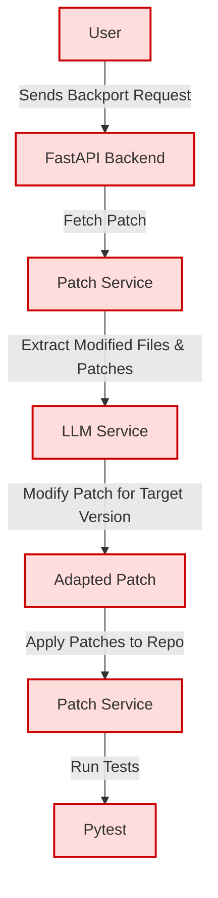

# Automation Tool for Patch Backporting

This is an automated tool that integrates the LLM to suggest and apply patches to older versions in Python open source projects. Using [FastAPI](https://fastapi.tiangolo.com/#installation) with [starcoder](https://huggingface.co/bigcode/starcoder) model from [Hugging Face](https://huggingface.co/).

## Project Structure

```bash
automation-tool-for-patch-backporting/
│
├── app/
│   ├── services
│   |   ├── __init__.py
│   |   ├── llm_services.py
│   |   └── patch_services.py
│   |
│   └── main.py
│
├── tests/
│   └── test_patch.py
│
├── .env
├── .gitignore
├── Dockerfile
├── README.md
├── Makefile
└── requirements.txt
```

## Prerequisites

Before you begin, ensure that you have the following installed:

- **Python**
- **Make**
- **Docker** (optional, for containerization)

## Installation

1. Clone the repository:

   ```bash
   git clone https://github.com/haiyen11231/automation-tool-for-patch-backporting.git
   cd automation-tool-for-patch-backporting
   ```

2. Create the app.env file:

Create a `.env` file in the root directory of the project. This file should contain the environment variables required for the application to run. Here's a sample `.env` file:

```env
HF_API_TOKEN=my_token
```

Update the values with your own configuration:

- **`HF_API_TOKEN`**: Define Access Token in Hugging Face.

3. Install dependencies:

   ```bash
   make install
   ```

4. Start the development server:

   ```bash
   make run
   ```

## CVEs Testing

1. [CVE-2024-52804](https://nvd.nist.gov/vuln/detail/CVE-2024-52804)

Applying [patch](https://github.com/tornadoweb/tornado/commit/d5ba4a1695fbf7c6a3e54313262639b198291533) from version 6.4.2 to [5.1](https://github.com/tornadoweb/tornado/tree/branch5.1)

2. [CVE-2024-52303](https://nvd.nist.gov/vuln/detail/CVE-2024-52303)

Applying [patch](https://github.com/aio-libs/aiohttp/commit/bc15db61615079d1b6327ba42c682f758fa96936) from version 3.10.11 to [3.10.7](https://github.com/aio-libs/aiohttp/tree/v3.10.7)

3. [CVE-2024-42474](https://nvd.nist.gov/vuln/detail/CVE-2024-42474)

Applying [patch](https://github.com/streamlit/streamlit/commit/3a639859cfdfba2187c81897d44a3e33825eb0a3) from version 1.37.0 to [1.35.0](https://github.com/streamlit/streamlit/tree/release/1.35.0)

4. [CVE-2024-42353](https://nvd.nist.gov/vuln/detail/CVE-2024-42353)

Applying [patch](https://github.com/Pylons/webob/commit/f689bcf4f0a1f64f1735b1d5069aef5be6974b5b) from version 1.8.8 to [1.8.5](https://github.com/Pylons/webob/tree/1.8.5)

5. [CVE-2024-41129](https://nvd.nist.gov/vuln/detail/CVE-2024-41129)

Applying [patch](https://github.com/canonical/operator/commit/fea6d2072435a62170d4c01272572f1a7e916e61) from version 2.15.0 to [2.14.0](https://github.com/canonical/operator/tree/2.14.0)

6. [CVE-2024-49768](https://nvd.nist.gov/vuln/detail/CVE-2024-49768)

Applying [patch](https://github.com/Pylons/waitress/commit/e4359018537af376cf24bd13616d861e2fb76f65) from version 3.0.1 to [2.1.0](https://github.com/Pylons/waitress/tree/v2.1.0)

7. [CVE-2024-47532](https://nvd.nist.gov/vuln/detail/CVE-2024-47532)

Applying [patch](https://github.com/zopefoundation/RestrictedPython/commit/d701cc36cccac36b21fa200f1f2d1945a9a215e6) from version 7.3 to [7.0](https://github.com/zopefoundation/RestrictedPython/tree/7.0)

## Flow of Request Diagram


